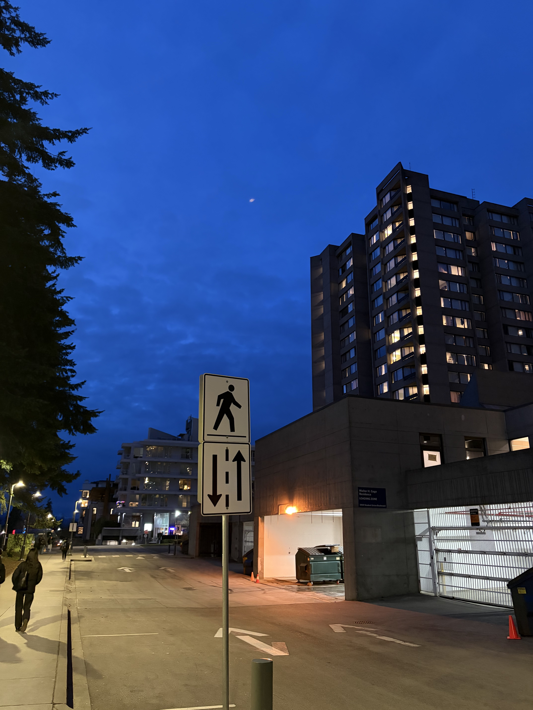
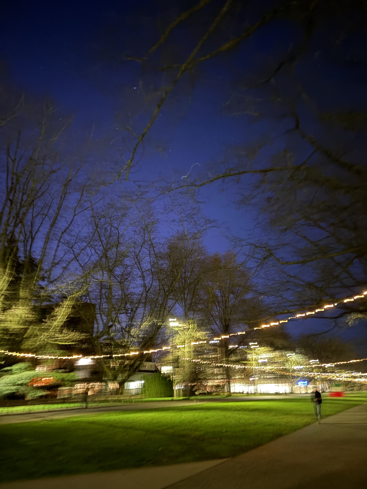
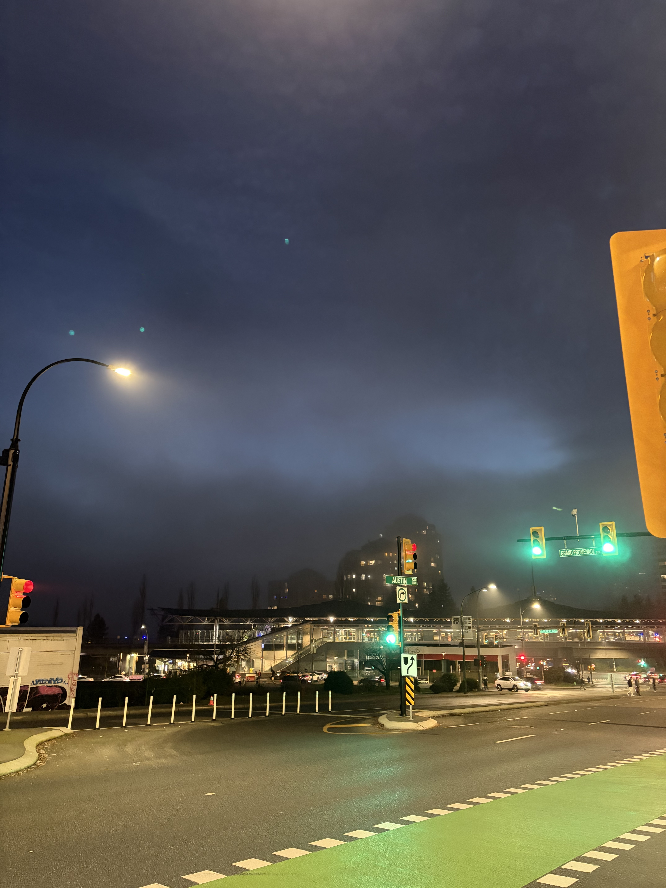
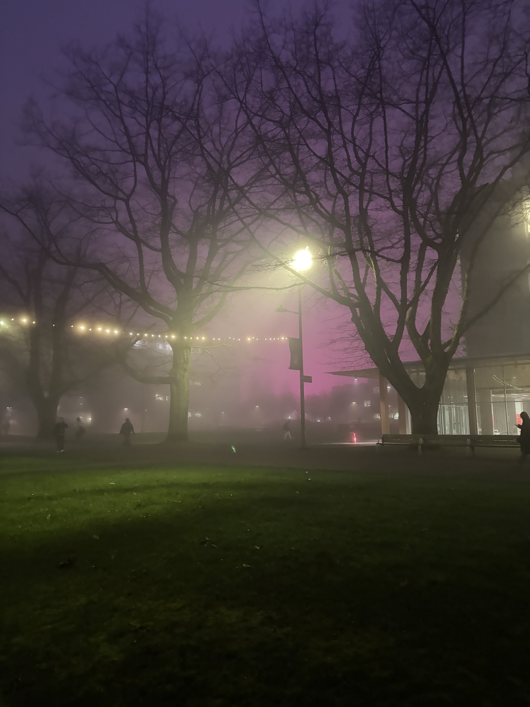
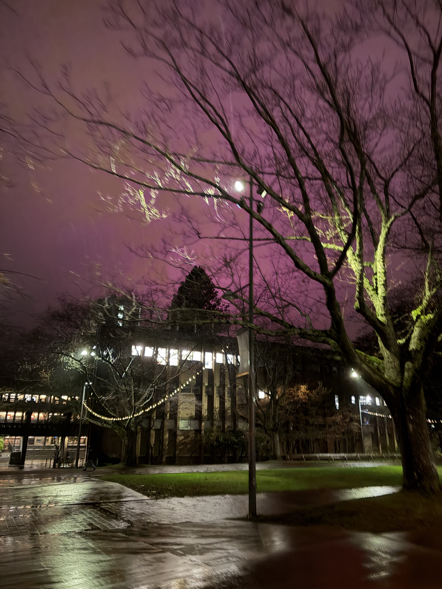
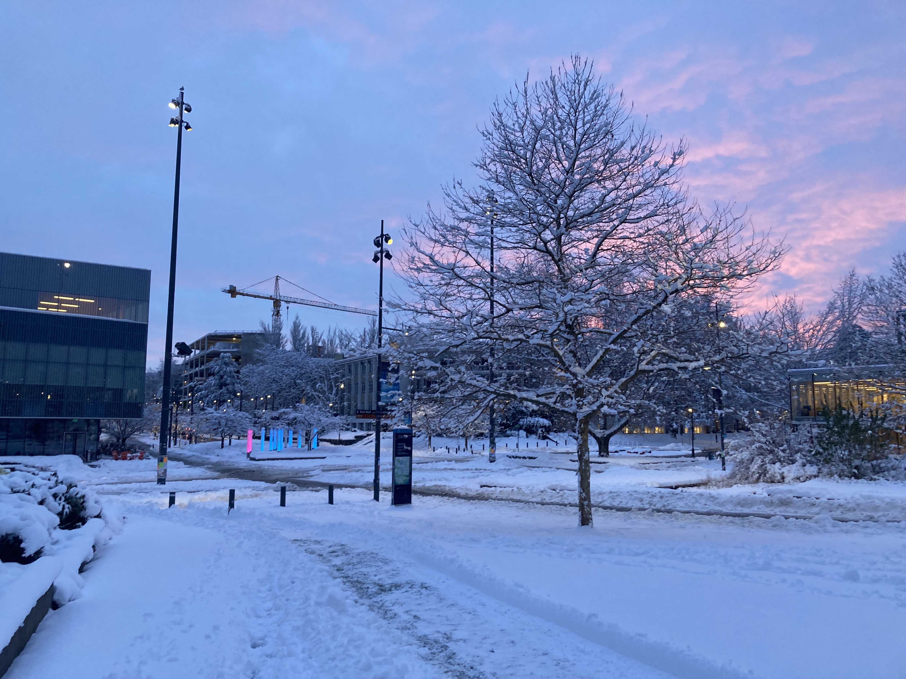
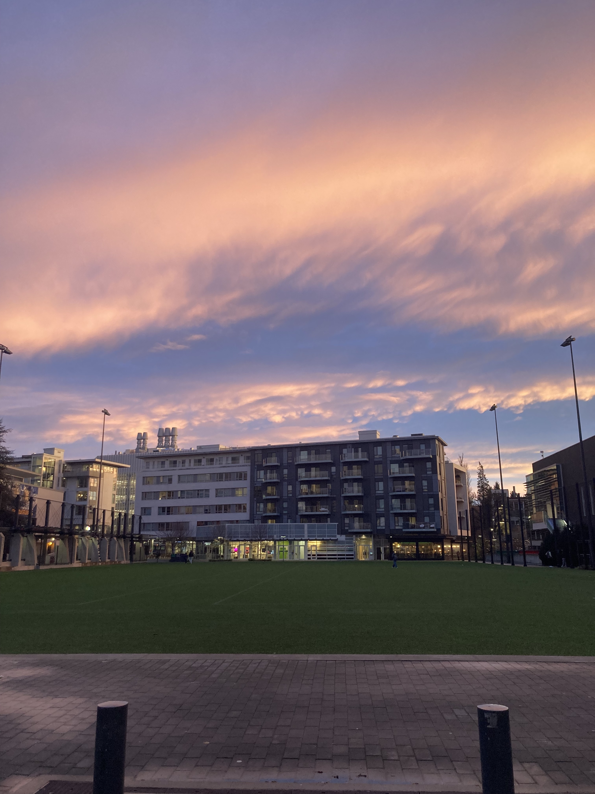
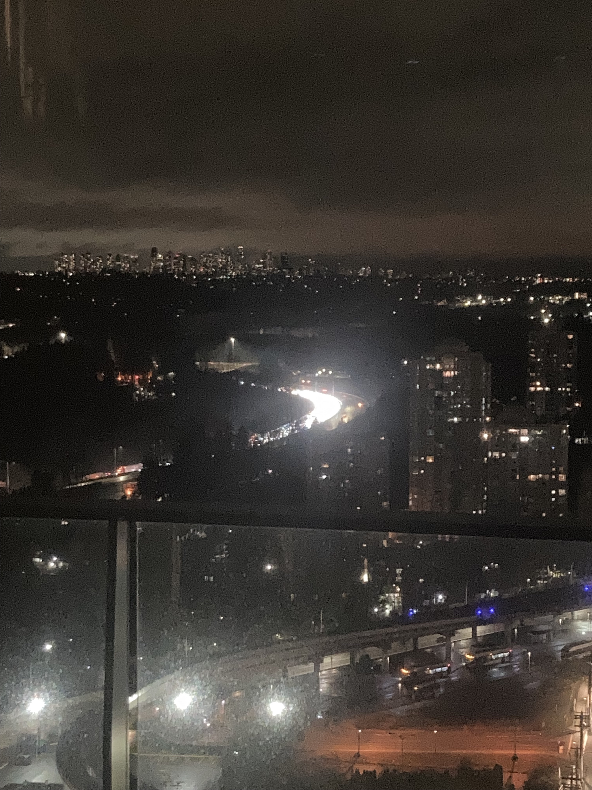
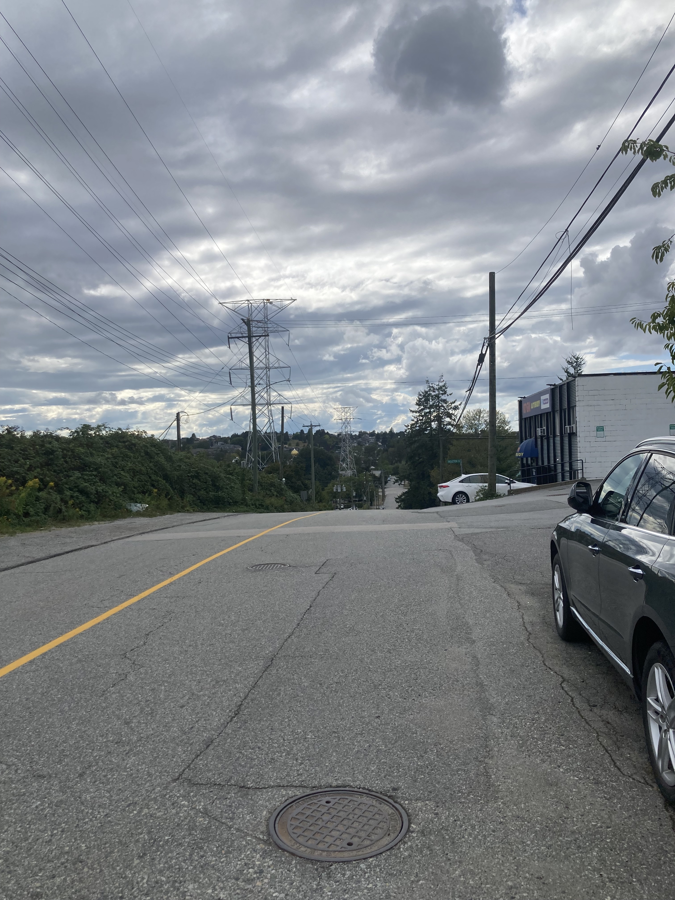

### CRWR 301 : 13 Ways of Looking Bjorn Holst

My principal subject matter is that of liminal spaces and memories. First, I think it’s important to define what I mean by liminal spaces.

Liminal in the dictionary has two definitions:
1. of, relating to, or situated at a sensory threshold : barely perceptible or capable of eliciting a response
2. of, relating to, or being an intermediate state, phase, or condition : in-between, transitional

Both definitions are interesting to my subject matter. I want to focus on moments in time that feel dreamy and that represent a broader change. I feel as if the power of photos is to capture moments that would otherwise be forgotten. In order to generate the images I was looking for, I focused on taking photos of times and places that felt beautiful to me, particularly those that I would otherwise forget soon after. By recording the beauty in forgotten moments, I hope to capture the essence of what makes these hazy, liminal moments in my poetry.

The fog that lasted weeks was one of the most beautiful things to appear on campus, and couldn’t have happened at a better time. Taking many photos, I found beauty in the blurred lights that illuminate the fog, creating an aesthetic reminiscent of what I would imagine the London pea soup fog to be. To me, the fog creates a moment that feels like walking through a memory. In the same way our memories fuzz and obscure with time, so too did walking through the fog obscure my own perception of campus. In between the opaque and the transparent, the fog creates its own liminal space, the image of which I borrowed for my poem “Golden Fog Ghazal”.

This photo was taken outside my apartment on a path I’ve walked hundreds of times before. Usually when taking photos, I try to avoid extraneous elements like roadsigns, but this time, it felt right to keep the sign in the composition. For that night only, the sky looked blue and magical, in a way I’ve never seen before. It almost felt like the world was underwater. I hoped in taking this picture, that my memory of this moment would be preserved, and that I would look at the road outside my house a little more magically from now on.

This photo had me experimenting with composition a little bit more. The forest outside the nest has always felt very liminal to me, in part because it separates my home from the location of most of my classes. That means every morning, for nearly two years, I’ve walked across this forest on my way to class, every weekday, multiple days a week. Taking this photo with the sun peering out a small channel in the center almost made it look like a small portal to another world; and reminded me that the transition between the natural and artificial is a beautiful point of liminality as well; one that poets such as Margaret Atwood have delved into extensively.

I remember taking this photo after a late night exam at ICICS. Notably, it was an hour after the pro-Iranian peace protests had occurred on campus, judging by the Iranian flag on the cairn in the background. The blur in the photo caused by my movement makes this image to me look as if it’s dancing. Like all the other images here, this image evokes strong emotions in me, despite the fact that visually, it’s fairly simple. It’s a photo of a feeling. Of a smell, of the cold in the air, and of my mind in that exact moment. 

I took this photo on my way home one evening. Notably, this photo is facing opposite to the direction I was walking, which tells me I had likely been paused for some time to take it. I’ve walked past this road a hundred times, and yet it’s odd I’d never noticed how beautiful the traffic lights are. I don’t think I’ve ever really heard someone call traffic lights beautiful either. That’s what’s so beautiful about liminal moments to me. They don’t have to be grand, and expressly beautiful. They just need to remind you of something purposeful and transitory.   

Inspired by the photo prior, I went on to take a couplet photo, one with the wet roads basked in green light, and one with red lights. This image to me also carries a dreamlike quality, in fact it doesn’t look entirely real. The lights streaking across the road is something I would have never noticed prior. I mean it’s only obvious that a wet road will reflect light. But it’s beautiful. I’ve been getting into drawing/painting recently, and I suspect the eyes I’ve been developing there are helping me see beauty in moments I would have previously ignored. 

I grew up unable to see beauty distinctly. I recall going on hikes with my family, and them asking me, at the focal point, or peak of the mountain, “Doesn’t this look beautiful?”
I remember always responding “it looks fine”. It’s supposed to look like this, is it not?
Attached above are photos I took of what I assume is the UBC greenhouse lights creating a dark pink sky at night. It’s an image that conveys itself beautifully to me, and I would have otherwise forgotten these nights entirely, since remembering them doesn’t make me better in any way. But I enjoy looking at them, and I find them beautiful. Besides, a pink night is a beautiful poetic image. 

This was the first poetic inquiry I performed that didn’t involve photographs. Unlike the previous photos that I photographed in order to remember, this inquiry involved a memory with no photographs attached. I remember my father rocking me to sleep with rock music as a baby. Despite being young, I remember the moment exactly. This time, I drew old Van Halen guitars with oil pastels, while listening to rock music on blast. I drew three guitars (given we were doing tercets), specifically the Frankenstein, the Charvel Star, and the Ibanez Flying V. Incidentally, this experience also taught me that creamy oil pastels are not particularly suited to drawing something as clean and rigid as a guitar. But I enjoyed indulging in the memory anyways.

This photo is unlike the other photos of skies and walkways, but is still very liminal. The photo is of a sofreh (a spread) taken during the night of Yalda in Persian traditions. I spent the night with my family drinking tea, eating pomegranate, and eating almonds. Yalda is a transitory holiday, in that it occurs on Winter Solstice, during the longest night of the year. It is the transition between long nights and shorter nights. Unlike the previous photos that are very specific to me, this photo includes a larger liminal in-group, with many Iranians recognizing what it feels like to be inside this photo with their families on Yalda night. I additionally used the imagery of the pomegranate from this photo to help me with my Monostitch poetry.

This photo wasn’t taken this year, but instead on Jan 18, 2024, 7:46 AM. It’s a memory. Which means I would have been 10 minutes late to my CPSC 310 class at this pace. But the snow was beautiful, the air was nippy, the sky looked like cotton candy. I felt desperately alone. Each of my days was passing as if it was only me. But despite being late to class, I still wanted to capture this fragment in time, because I thought it was beautiful, and I wanted to remember it. In many ways, this picture feels liminal to me because it’s a photo I took during a transitory period of my growth. It was around this time that prospects after university started becoming more serious for me. I had recently turned 20, and I was no longer a teenager anymore.

This photo was taken during exam season on December 14th, 2024. Usually during exam season, everything aside from my studies fades away, and I’m left with a hole in my memories where I had holed myself up to study. I think in part, much of this feels liminal because as a computer science student, I spent a long time feeling as if everything aside from computer science was a transition. My commute, a transition, time spent outside of class, just a transition between classes. I like this photo, because it felt like one of the first times I broke out of that cycle, and admired a moment’s beauty despite the stress of exams.

I remember taking this photo. I recently started my co-op. I was dealing with some sickness and nausea at the time, and I was tired. I was more injured than I had ever been. It still hurt to sleep. It was a Saturday, I didn’t have work the day after. As I looked out onto the road, I couldn’t help but think it looked as if the cars were liquid light, pouring through the highway like a river. This photo is liminal to me because it represents a transitional moment in my life. Switching from university to co-op was a large shift, which was compounded by my injury forcing me to be more sedentary than ever. I changed considerably over the course of this year, 2025. 

This photo brings back so many memories for me. -My knee had been badly injured. As part of my physiotherapy, and with a strong need to condition my knee, because I couldn’t do anything so intensive, I decided to walk from Coquitlam, to Science World. I think it was a roughly ~5 hour walk. I remember passing through Holdom, and god knows where this picture was taken. I wanted to at least play a bit of Pokemon Go, but I couldn’t really even. My mind wouldn’t let me rest. When I see this picture, I feel an emotion I don’t think I’ve ever felt since. Something between manic, free, calm, and scared.

I think the power of the photos for me personally, is that they allow me to remember beautiful moments that would otherwise be forgotten, and re-experience feelings that would otherwise be lost. To quote author Robin Wall Kimmerer in her book Braiding Sweetgrass,

> Breathe it in, and you start to remember you didn't know you'd forgotten